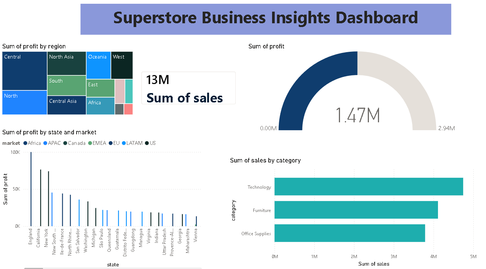

# Retail Insights – E-Commerce Sales Analysis

## About the Project

In this project, I worked with the Superstore Sales Dataset to understand sales and profit patterns across different categories, products, regions, and customer segments.

The dataset was first cleaned and explored to understand its structure. After that, different analyses and visualizations were created to identify trends and extract useful business insights.

---

## Tools Used

- Python
- Pandas
- NumPy
- Matplotlib
- Seaborn
- Jupyter Notebook
- Power BI

---

## Dataset Details

- Total Records: 51,290
- Total Columns: 21
- Time Period: 2011 to 2014

---

## Work Completed

### Data Preparation

- Checked missing values
- Checked duplicate records
- Converted date columns into datetime format
- Examined outliers in Sales and Profit columns

### Exploratory Data Analysis

The following analyses were performed:

1. Monthly Sales Trend Analysis
2. Profit by Category
3. Top 10 Products by Sales
4. Top 10 Loss-Making Products
5. Sales vs Profit Relationship
6. Regional Profit Analysis
7. Impact of Discount on Profit

---

## Main Findings

- Sales increased gradually from 2011 to 2014.
- Technology generated the highest profit among all categories.
- A small number of products contributed a large share of overall sales.
- Some products repeatedly generated losses.
- Profit performance differed across regions.
- Higher discounts often reduced profitability.
- The highest sales were recorded near the end of 2014.

---

## Project Structure

Retail-Insights-Ecommerce-Sales-Analysis/

├── data/

├── notebooks/

│ └── retail_analysis.ipynb

├── images/

├── dashboard/

└── README.md

---

## Conclusion

The project helped in understanding how different business factors such as category, region, product performance, and discount levels affect sales and profit. The analysis also showed how data visualization can be used to identify trends and support business decision-making.

---
## Dashboard Preview

## Author

Nidhi Yadav
